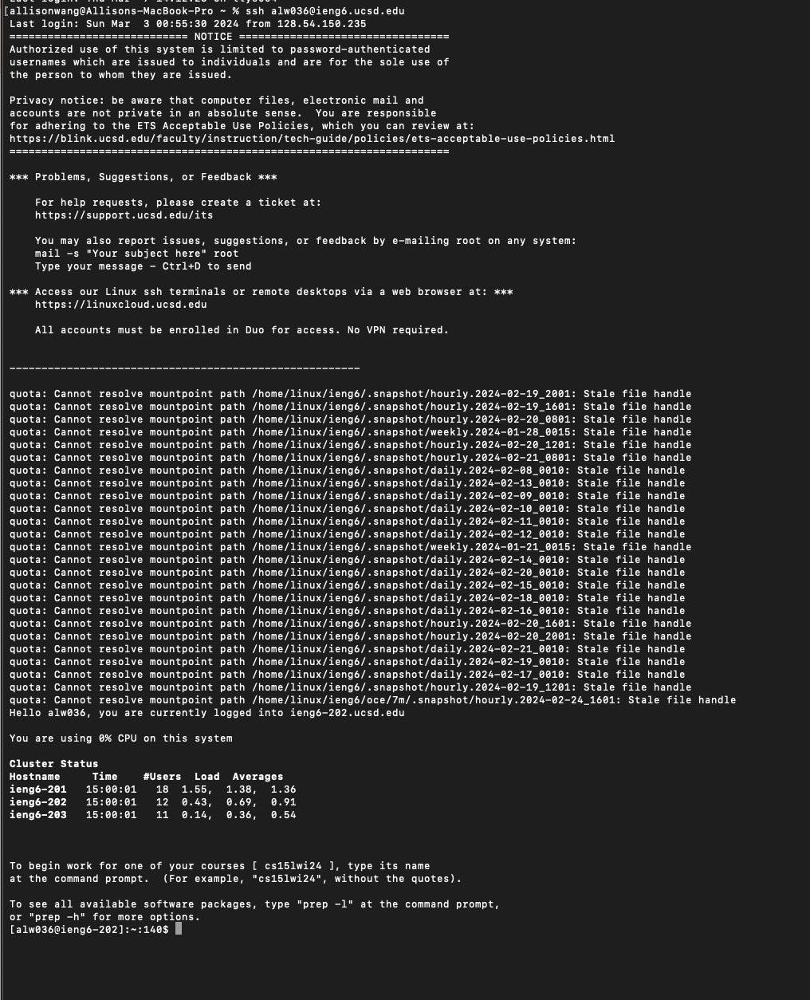
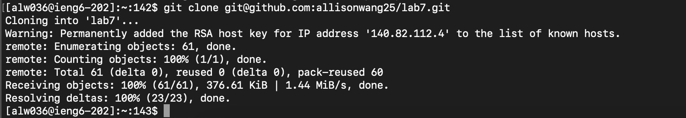
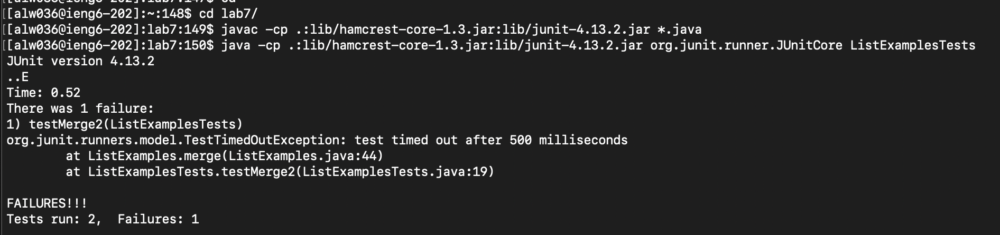
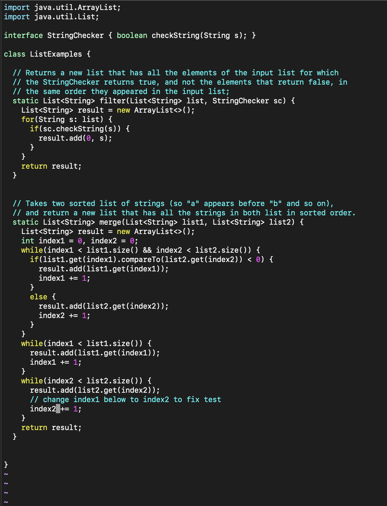
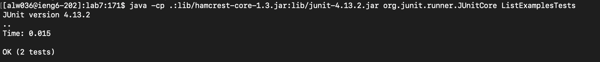
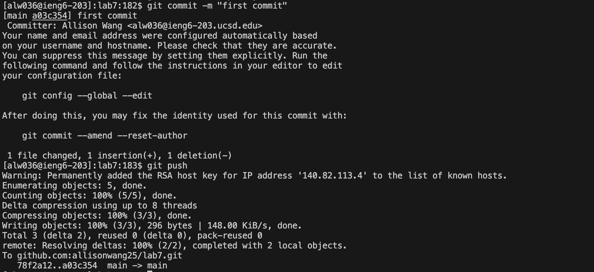

# Lab Report #4: Vim
1. Log into ieng6
    * 
    * accomplished by typing: `ssh alw036@ieng6.ucsd.edu <enter>`
      * **ssh alw036@ieng6.ucsd.edu** : log in to virtual machine
2. Clone your repository
    * 
    * accomplished by typing: `git clone <Ctrl-V> <enter>`
      * **git clone** : clones github repository using ssh key
      * **\<Ctrl-V\>**: pastes what is in clipboard which is *git@github.com:allisonwang25/lab7.git*
    
3. Run test, test fail
    * 
    * accomplish by typing: 
      ```
      cd lab7/ <enter>
      <Ctrl-r> javac <enter>
      <Ctrl-r> java<space> <enter>
      ```
      * **cd** : changes current directory to lab7, the directory with all the files
      * **\<Ctrl-r\>** : access bash history and search the characters given after
        * when inputed with "javac", the result that comes up is `javac -cp .:lib/hamcrest-core-1.3.jar:lib/junit-4.13.2.jar *.java` which compiles all java files
        * when inputed with "java ", the result that comes up is `java -cp .:lib/hamcrest-core-1.3.jar:lib/junit-4.13.2.jar org.junit.runner.JUnitCore ListExamplesTests` which runs the java file ListExamplesTests with junit
4. Edit code to fix bugs
    * 
    * accomplish by typing: 
      ```
      vim ListExamples.java <enter>
      43j e s 2 <escape> :wq
      ```
      * **vim ListExamples.java** : open vim editor for ListExamples.java
      * **43j** : execute j command, which moves cursor down, 43 times
      * **e** : move to end of next word
      * **s** : delete the character cursor is on (1 in this case) and turn on editting mode to replace that character with next typed character(2 in this case)
      * **\<escape\>** : exits from editing mode of vim
      * **:wq** : save and quit vim editor
5. Run tests, tests succeed
    * 
    * accomplish by typing:
      ```
      <Ctrl-r> javac <enter>
      <Ctrl-r> java<space> <enter>
      ```
      * **\<Ctrl-r\>** : access bash history and search the characters given after
        * when inputed with "javac", the result that comes up is `javac -cp .:lib/hamcrest-core-1.3.jar:lib/junit-4.13.2.jar *.java` which compiles all java files
        * when inputed with "java ", the result that comes up is `java -cp .:lib/hamcrest-core-1.3.jar:lib/junit-4.13.2.jar org.junit.runner.JUnitCore ListExamplesTests` which runs the java file ListExamplesTests with junit
6. Commit and push
    * 
    * accomplish by typing: 
      ```
      <Ctrl-r> git<space>a <enter>
      <Ctrl-r> git<space>c <enter>
      <Ctrl-r> git<space>p <enter>
      ```
      * **\<Ctrl-r\>** : access bash history and search the characters given after
        * when inputed with "git a", the result that comes up is `git add ListExamples.java` which adds the changes in ListExamples into the next commit  
        * when inputed with "git c", the result that comes up is `git commit -m "first commit"` which records changes to the local repository
        * when inputed with "git p", the result that comes up is ` git push -u git@github.com:allisonwang25/lab7.git` which pushes changes to the main branch, sending the local repo to Github
