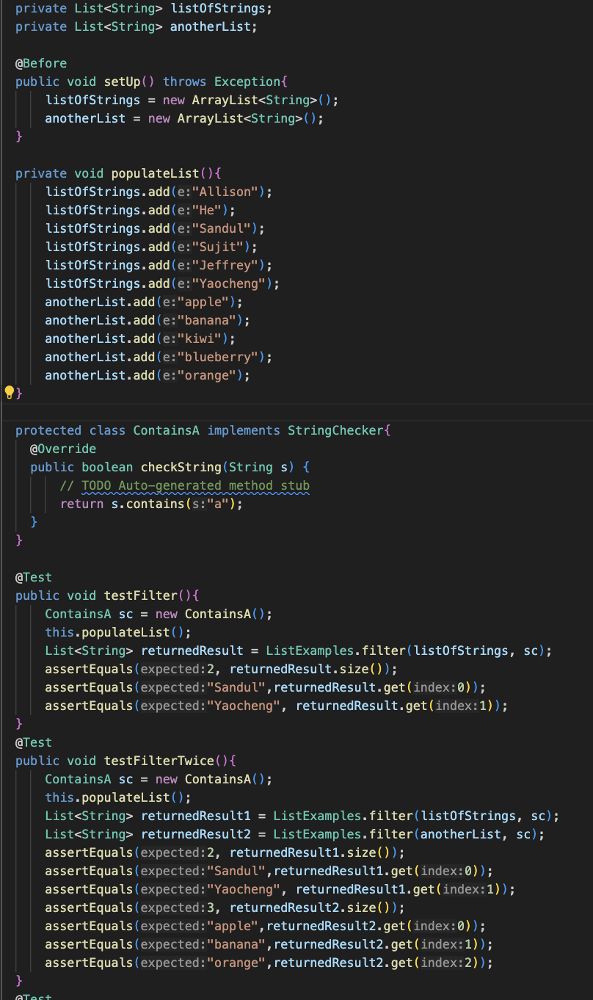
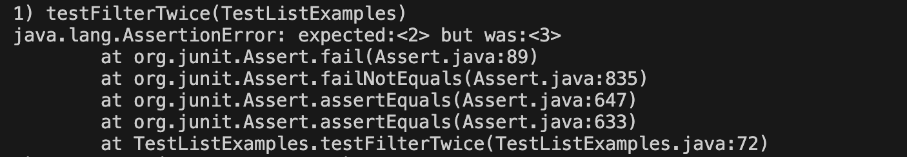
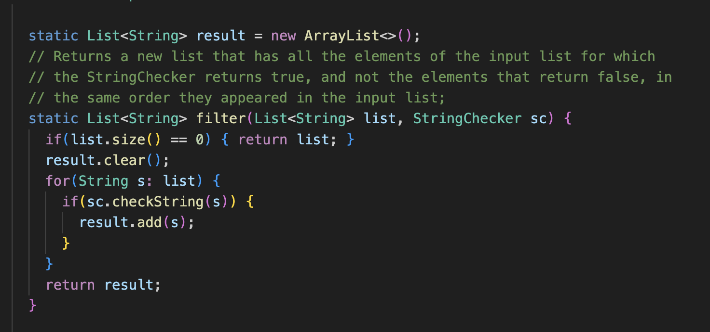
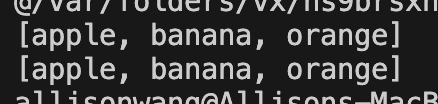

# Lab Report 5: Putting it All Together
## Part 1: Debugging Scenario
1. **The Student's Original Post:**\
  I'm having trouble with my Java program. When I use the List method, filter, it works fine when filtering one list but not two, 
  and I'm not sure why. Here's a screenshot of the tests, the error message that JUnit is giving me, as well as my method
  implementation:
    - Tests:\
      
    - Error Message:\
      
    - Method Implementation:\
      
    - *Symptom:* Filter method passes on the first test, testFilter, but fails on the second test, testFilterTwice
    - *Guessed Bug:* I think it may have something to do with the method and ArrayList being static? It feels a little off but am 
    not sure why. Can someone help me figure out what's going on?
2. **TA's Response:**\
  Consider the fact that the static label indicates that the variable is tied to the class itself, meaning it maintains its
  memory space across different calls to the filter method. Remember again that when initializing variables to equal an object,
  it just instantializes the variable as a pointer to that object. What do these facts mean in conjunction? It may help to print
  out the element of the list each time you run the filter method.  Let me know if this helps.
3. **Trying the command, Terminal Output:**\
   
     - This shows that both list variables hold the same values, indicating that it points to the same memory space due to the static nature of the List in the ListExamples Class, making the static nature of the list the bug in question. Since they point to the same memory space, when the filter method is run a second time, the data is cleared and overwritten for both variables now holding the static List<String> result
4. Setup:
     - File/Directory Structure
       ```
        ├── lib
        │   ├── junit-4.13.2.jar
        │   ├── hamcrest-core-1.3.jar
        ├── test.sh
        ├── ListExamples.java
        └── TestListExamples.java
       ```
     - Contents before fixing the bug
       - test.sh\
       ```
       CPATH=".:lib/hamcrest-core-1.3.jar:lib/junit-4.13.2.jar"

       javac -cp $CPATH *.java
       java -cp $CPATH org.junit.runner.JUnitCore TestListExamples
       ``` 
       - ListExamples.java\
       ```
        import java.util.ArrayList;
        import java.util.List;
        
        interface StringChecker { boolean checkString(String s); }
        
        class ListExamples {
        
          static List<String> result = new ArrayList<>();
          // Returns a new list that has all the elements of the input list for which
          // the StringChecker returns true, and not the elements that return false, in
          // the same order they appeared in the input list;
          static List<String> filter(List<String> list, StringChecker sc) {
            if(list.size() == 0) { return list; }
            result.clear();
            for(String s: list) {
              if(sc.checkString(s)) {
                result.add(s);
              }
            }
            return result;
          }
        
        
          // Takes two sorted list of strings (so "a" appears before "b" and so on),
          // and return a new list that has all the strings in both list in sorted order.
          static List<String> merge(List<String> list1, List<String> list2) {
            List<String> result = new ArrayList<>();
            int index1 = 0, index2 = 0;
            while(index1 < list1.size() && index2 < list2.size()) {
              int compared = list1.get(index1).compareTo(list2.get(index2));
              if(compared == 0) {
                result.add(list1.get(index1));
                index1 += 1;
                index2 += 1;
              }
              else if(compared < 0) {
                result.add(list1.get(index1));
                index1 += 1;
              }
              else {
                result.add(list2.get(index2));
                index2 += 1;
              }
            }
            while(index1 < list1.size()) {
              result.add(list1.get(index1));
              index1 += 1;
            }
            while(index2 < list2.size()) {
              result.add(list2.get(index2));
              index2 += 1;
            }
            return result;
          }
        }

       ```
       - TestListExamples.java\
       ```
        import static org.junit.Assert.*;
        import org.junit.*;
        
        import java.util.ArrayList;
        import java.util.Arrays;
        import java.util.List;
        
        public class TestListExamples {
          private List<String> listOfStrings;
          private List<String> anotherList;
        
          @Before
          public void setUp() throws Exception{
              listOfStrings = new ArrayList<String>();
              anotherList = new ArrayList<String>();
          }
        
          private void populateList(){
              listOfStrings.add("Allison");
              listOfStrings.add("He");
              listOfStrings.add("Sandul");
              listOfStrings.add("Sujit");
              listOfStrings.add("Jeffrey");
              listOfStrings.add("Yaocheng");
              anotherList.add("apple");
              anotherList.add("banana");
              anotherList.add("kiwi");
              anotherList.add("blueberry");
              anotherList.add("orange");
          }
        
          
          protected class ContainsA implements StringChecker{
            @Override
            public boolean checkString(String s) {
                // TODO Auto-generated method stub
                return s.contains("a");
            }
          }
          
          @Test
          public void testFilter(){
              ContainsA sc = new ContainsA();
              this.populateList();
              List<String> returnedResult = ListExamples.filter(listOfStrings, sc);
              assertEquals(2, returnedResult.size());
              assertEquals("Sandul",returnedResult.get(0));
              assertEquals("Yaocheng", returnedResult.get(1));
          }
          @Test
          public void testFilterTwice(){
              ContainsA sc = new ContainsA();
              this.populateList();
              List<String> returnedResult1 = ListExamples.filter(listOfStrings, sc);
              List<String> returnedResult2 = ListExamples.filter(anotherList, sc);
              assertEquals(2, returnedResult1.size());
              assertEquals("Sandul",returnedResult1.get(0));
              assertEquals("Yaocheng", returnedResult1.get(1));
              assertEquals(3, returnedResult2.size());
              assertEquals("apple",returnedResult2.get(0));
              assertEquals("banana",returnedResult2.get(1));
              assertEquals("orange",returnedResult2.get(2));
          }
          @Test
          public void testMerge(){
              List<String> alphabet1 = new ArrayList<>();
              List<String> alphabet2 = new ArrayList<>();
              List<String> alphabet3 = new ArrayList<>();
              alphabet1.add("a");
              alphabet1.add("c");
              alphabet1.add("d");
              alphabet2.add("b");
              alphabet2.add("e");
              alphabet2.add("f");
              alphabet3.add("a");
              alphabet3.add("b");
              alphabet3.add("c");
              alphabet3.add("d");
              alphabet3.add("e");
              alphabet3.add("f");
        
        
              List<String> returnedResult = ListExamples.merge(alphabet1, alphabet2);
              assertEquals(6, returnedResult.size());
              assertEquals(returnedResult, alphabet3);
              assertEquals("a",returnedResult.get(0));
              assertEquals("b", returnedResult.get(1));
              assertEquals("c", returnedResult.get(2));
              assertEquals("d", returnedResult.get(3));
              assertEquals("e", returnedResult.get(4));
              assertEquals("f", returnedResult.get(5));
          }
          @Test(timeout = 500)
          public void testMerge1() {
            List<String> left = Arrays.asList("a", "b", "c");
            List<String> right = Arrays.asList("d");
            List<String> merged = ListExamples.merge(left, right);
            List<String> expected = Arrays.asList("a", "b", "c", "d");
            assertEquals(expected, merged);
          }
          @Test(timeout = 500)
          public void testMerge2() {
            List<String> left = Arrays.asList("a", "b", "c");
            List<String> right = Arrays.asList("a","d");
            List<String> merged = ListExamples.merge(left, right);
            List<String> expected = Arrays.asList("a","a", "b", "c", "d");
            assertEquals(expected, merged);
          }
          
        }

       ```
     - command lines I ran\
       `allisonwang@Allisons-MacBook-Pro buggy % bash test.sh`
     - How to fix the bug
       - By moving the creation of the list into the filter method, removing the static label, and removing the line
         `results.clear()`, we have now corrected the bug.
   
   
## Part 2: Reflection
In the second half of this quarter, I learned the functionalities of vim and ways to speed up processes in the terminal. 
For example, I learned how to use Ctrl-R to search through past bash commands as well as typing a number before a vim shortcut to 
execute that command the specified number of times. 
